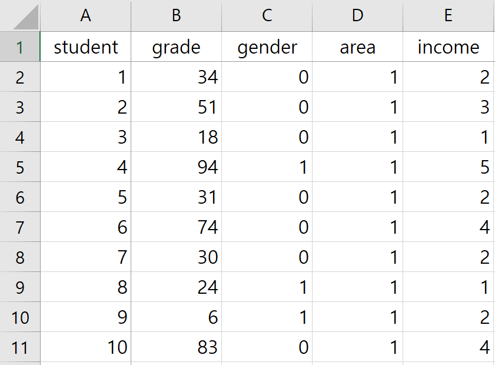

```{r}
library(tidyverse)
library(haven) # SPSS 자료를 읽기 위한 라이브러리
library(Hmisc) # label
library(lawstat) # Levene.test
library(agricolae) # Scheffe.test
library(flextable) # 표 출력
library(psych)
library(readxl)
library(data.table) # as.data.table
```

```{r my_function.R, echo = FALSE, message = FALSE, warning = FALSE, eval = TRUE, out.width = "75%"}
source('my_functions//my_functions-2021-07-16.R', encoding='utf-8')
```


# 연구의 목적에 따라 원하는 결과로부터 시작하기
이 책은 R의 문법에서 시작하지 않고 원하는 결과를 얻기 위한 수단으로서 R을 배우는 것에서 출발한다. 여기에서는 연구의 목적이 학업 성취도에 성별, 지역별, 경제적 수준이 어떤 영향을 미치는 것을 분석하기 위한 것이라고 가정하자. 

## 데이터 읽기

자료는 가장 많이 사용하는 엑셀 자료로서 mydata.xlsx로 저장되어 있다. 이를 먼저 살펴보면 <그림 1>과 같이 5개의 변수로 구성되어 있다. 변수는 student(학생), grade(성적), gender(성별), area(지역), income(경제적 수준)으로 구성되어 있고 조사 대상 학생 수는 100명이다.
성별은 1(남성) 46명, 0(여성) 54명이고 지역은 1지역(서울) 30명, 2지역(경기) 32명, 3반(인천) 38명여며, 경제적 수준은 1분위 22명, 2분위 17명, 3분위 29명, 4분위 20명, 5분위 12명으로 구성되어 있다. 경제적 수준의 경우 숫자는 분위를 의미하며 숫자가 높을수록 경제적 수준이 높다.




엑셀 자료를 읽기 위해서는 readxl이라는 라이브러리가 필요하다. 이를 설치하기 위해서는 다음과 같은 명령어를 수행해야 한다.

```{r, eval = FALSE}
install.packages("readxl")
```

설치가 성공적으로 완료되었다면 다음과 같이 해당 패키지를 메모리에 올려야 한다.

```{r}
library(readxl)
```

이제 자료를 읽을 준비가 되었다. 읽는 명령어는 간단하다.

```{r}
dc <- read_excel("data//mydata.xlsx")
```

read_excel은 readxl 패키지에 있는 것으로서 엑셀 자료를 읽는 명령어이다. 자료가 현재 폴더의 하위 폴더인 data에 저장되어 있기 때문에 "data//"를 이용하여 폴더를 지정하였다. 윈도우에서 하위 폴더는 "/"이지만 특수 문자로 처리해야 하기 때문에 "//"를 사용한다.

읽은 자료는 "dc <- "를 이용하여 dc로 저장하였다. dc는 데이터프레임으로 엑셀 자료와 비슷한 형태의 성격을 지닌다. 자료의 형태를 살펴보기 위해서는 다음과 같이 dc를 치면 된다.

```{r}
dc
```

첫 줄에는 자료의 형태와 차원이 'A tibble: 100 x 5'로 표시되어 있다. tibble은 데이터프레임과 비슷한 형식이다. 지금은 대부분의 경우 tibble과 데이터프레임을 구분할 필요는 없기 때문에 당장은 tibble이 데이터프레임의 발전된 형태라고 생각하면 된다. '100 x 5'는 관측치 수는 100개이고 변수는 5개라는 것을 알려준다. 각 변수의 이름은 두 번째 줄에 student, class, gender, grade, income으로 표시되어 있고 세 번째 줄에는 모두 모두 <dbl>로 표시되어 있다. 숫자로 저장되어 있는 엑셀을 그냥 읽었기 때문에 모든 변수는 모두 수치형 double 변수로 저장되는 것을 알 수 있다.


dc의 클래스를 알기 위해서는 아래와 같이 class 명령어를 이용하면 된다.

```{r}
class(dc)
```
"tbl_df"는 dc가 데이터프레임의 발전된 형태인 tibble임을 알려준다.

dc의 구조(structure)를 알기 위해서는 아래와 같이 str 명령어를 이용하면 된다.

```{r}
str(dc)
```

이를 통해 데이터의 성격, 차원, 변수명 및 변수 형식 등을 모두 확인할 수 있다. 차원을 나타내는 [100 x 5]는 tibble이 100개의 관측치를 갖는 5개의 변수로 구성되어 있다는 것을 말해준다. 모든 변수는 'num [1:100]'으로 표시되어 있는데, 이는 각각의 변수가 수치형(numeric)이고 100개의 관측치를 갖는 벡터임을 의미한다.


dc의 차원(dimmension)은 아래와 같이 dim 명령어를 이용해도 된다.

```{r}
dim(dc)
```


위에서 dc를 치면 10개의 관측치만 표시되고 나머지는 생력되어 있다. 앞 또는 뒤의 일정한 수의 관측치를 보려면 head 또는 tail 명령어를 사용할 수 있다.

에를 들어 앞의 20개 관측치를 보기 위해서는 head(dc, 20)을 치면 된다.

```{r}
head(dc, 20)
```
21번 째부터 30번 째까지 관측치, 1번 째, 3번 째 및 4번 째 변수를 살펴보기 위해서는 아래와 같이 dc[21:30, c(1,3:4]로 행과 열을 지정하면 된다.

```{r}
dc[21:30, c(1, 3:4)]
     
```

마지막 5개의 관측치를 보기 위해서는 tail(dc, 5)를 치면 된다. 

```{r}
tail(dc, 5)
```


## 조사대상의 특성을 보여주기

양적 분석에서 연구 결과가 설득력을 지니기 위해서는 먼저 표본의 편이가 없다는 것을 보여줘야 한다. 이를 위해 표본의 분포를 먼저 제시할 필요가 있다. 즉, 


```{r}
xft = dc$gender
yct = dc$grade
```


```{r, echo = FALSE, eval = FALSE}
my.ctables.t.simple(xft = xft, yct = yct, na.rm = TRUE, caption = NA)
```


```{r, echo = FALSE, warning = FALSE}
caption = "성별 학업 성취도"
my.ctables.t(xft = xft, yct = yct,
                         xft_name = NA, yct_name = NA, 
                         xft_level = NA, yct_level = NA,
                         cell_name = NA, na.rm = TRUE, ans = NA, 
                         header = FALSE, caption = caption, note = NA, print_note = FALSE, print_xft = FALSE,
                         spacing = NA)
```


```{r}
table(dc$gender)
table(dc$area)
table(dc$income)
```

```{r}
table(dc$gender, dc$area, dc$income)
```


```{r}
ft1 <- dc %>%
    group_by(dc[3]) %>%
    summarise(count = n())
ft1
```


```{r}
ct1 <- table(dc[3]) %>%
  addmargins()
pt1 <- prop.table(ct1, margin = 1)
ct1
pt1
```

